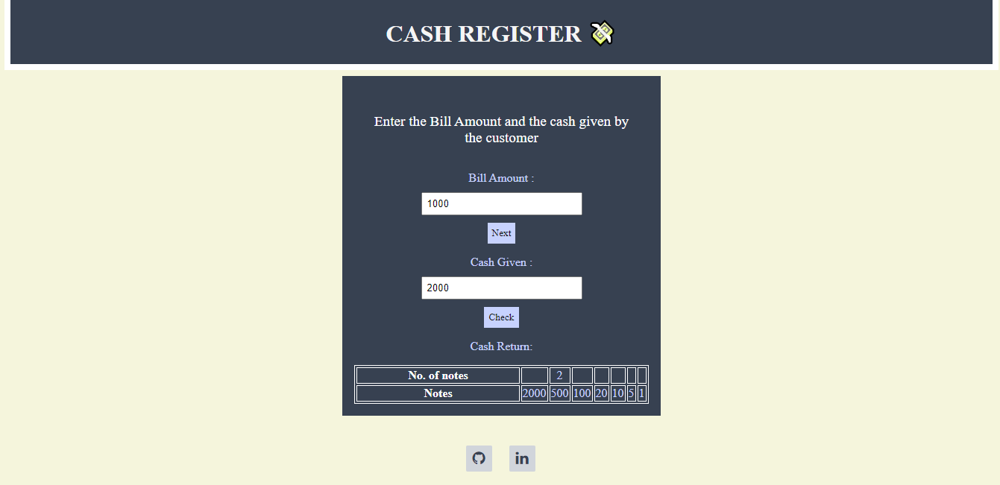

# CASH-REGISTER
A cash register Application is created using HTML,CSS and vanilla Js in which user can check how many notes will  
they get for certain bill amount and the amount they give MARK-10

# ScreenShots

